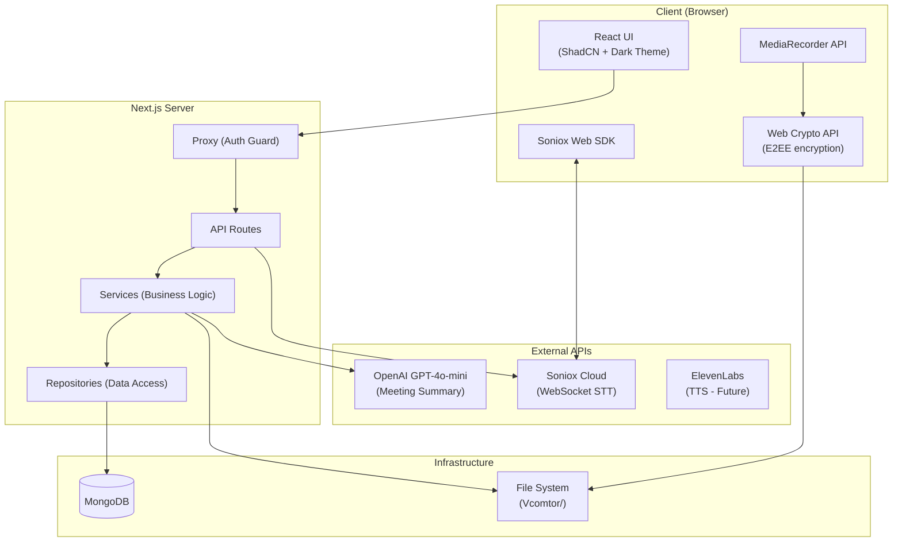
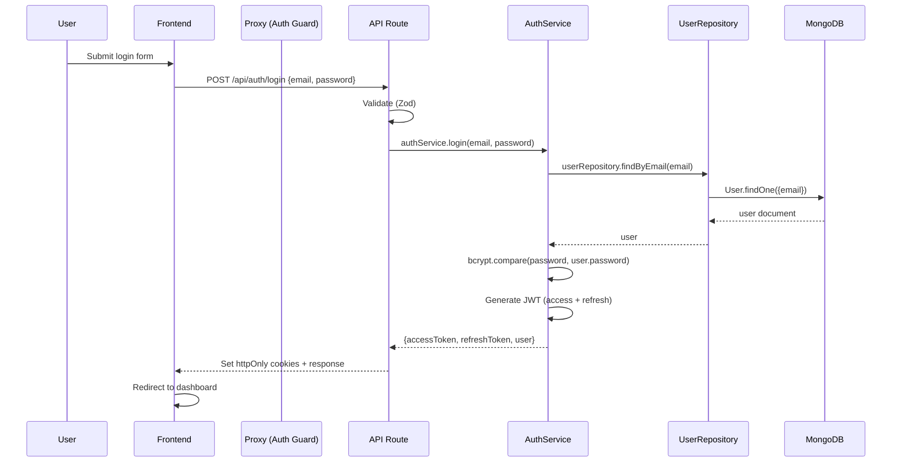
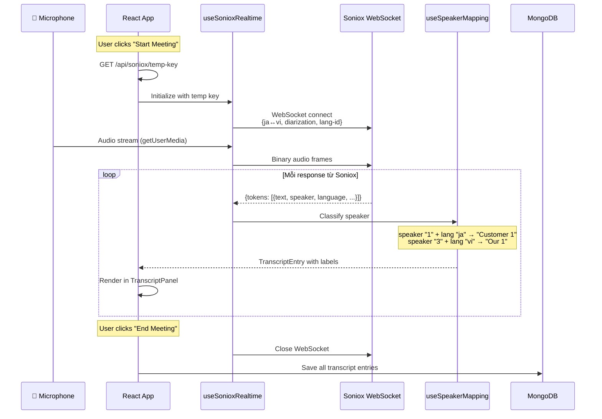
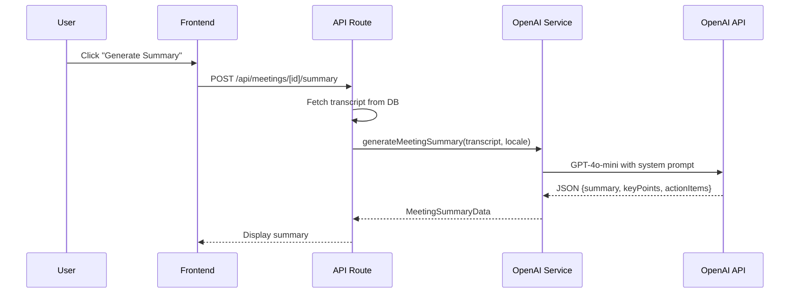

# Virtual Comtor — Kiến trúc dự án

## 1. Tổng quan kiến trúc



---

## 2. Cấu trúc thư mục

```
virtual_comtor/
├── docker-compose.yml
├── Dockerfile
├── .env
├── .env.example
├── package.json
├── tsconfig.json
├── next.config.ts               # CSP headers, standalone output
├── vitest.config.ts
├── components.json              # ShadCN config
│
├── Vcomtor/                     # Data volume (mounted)
│   ├── mongodb/                 # MongoDB data
│   └── storage/                 # User files (E2EE encrypted)
│       └── {userId}/
│           └── {meetingId}/
│               └── audio.enc    # Encrypted audio
│
├── src/
│   ├── app/                     # Next.js App Router (mỏng nhất)
│   │   ├── (auth)/              # Auth group
│   │   │   ├── layout.tsx
│   │   │   ├── login/
│   │   │   │   └── page.tsx
│   │   │   └── register/
│   │   │       └── page.tsx
│   │   │
│   │   ├── (dashboard)/         # Protected routes group
│   │   │   ├── layout.tsx       # Dashboard layout + sidebar
│   │   │   ├── dashboard/
│   │   │   │   └── page.tsx     # Dashboard home
│   │   │   ├── projects/
│   │   │   │   ├── page.tsx     # Project list
│   │   │   │   └── [projectId]/
│   │   │   │       └── page.tsx # Project detail + meeting list
│   │   │   ├── meetings/
│   │   │   │   └── [meetingId]/
│   │   │   │       └── page.tsx # Meeting room (live + review)
│   │   │   └── settings/
│   │   │       └── page.tsx     # User settings
│   │   │
│   │   ├── api/                 # API Routes
│   │   │   ├── auth/
│   │   │   │   ├── login/route.ts
│   │   │   │   ├── register/route.ts
│   │   │   │   ├── refresh/route.ts
│   │   │   │   ├── logout/route.ts
│   │   │   │   ├── me/route.ts
│   │   │   │   └── change-password/route.ts
│   │   │   ├── projects/
│   │   │   │   ├── route.ts             # GET list, POST create
│   │   │   │   └── [projectId]/
│   │   │   │       ├── route.ts         # GET, PUT, DELETE
│   │   │   │       └── meetings/
│   │   │   │           └── route.ts     # GET list, POST create
│   │   │   ├── meetings/
│   │   │   │   └── [meetingId]/
│   │   │   │       ├── route.ts         # GET, PUT, DELETE
│   │   │   │       ├── transcript/route.ts   # GET/POST transcript
│   │   │   │       ├── audio/route.ts        # POST upload audio
│   │   │   │       └── summary/route.ts      # POST generate AI summary
│   │   │   └── soniox/
│   │   │       └── temp-key/route.ts    # POST get temp API key
│   │   │
│   │   ├── layout.tsx           # Root layout
│   │   ├── page.tsx             # Landing page (redirect)
│   │   └── globals.css          # Global + dark theme CSS vars
│   │
│   ├── features/                # Feature-based organization
│   │   ├── auth/
│   │   │   ├── api/
│   │   │   │   └── authApi.ts
│   │   │   ├── components/
│   │   │   │   ├── LoginForm.tsx
│   │   │   │   └── RegisterForm.tsx
│   │   │   ├── hooks/
│   │   │   │   └── useAuth.tsx
│   │   │   └── index.ts
│   │   │
│   │   ├── projects/
│   │   │   └── api/
│   │   │       └── projectApi.ts
│   │   │
│   │   ├── meetings/
│   │   │   └── api/
│   │   │       └── meetingApi.ts
│   │   │
│   │   └── translation/         # ⭐ Core feature
│   │       ├── components/
│   │       │   ├── MeetingRoom.tsx        # Main container
│   │       │   ├── TranscriptPanel.tsx    # Scrollable transcript
│   │       │   ├── TranscriptEntryItem.tsx# Single transcript line
│   │       │   ├── TranscriptViewer.tsx   # Review transcript (post-meeting)
│   │       │   ├── MeetingSummary.tsx     # AI-generated summary display
│   │       │   ├── SpeakerBadge.tsx       # "Customer 1" / "Our 2"
│   │       │   ├── LanguageBadge.tsx      # 🇯🇵 / 🇻🇳
│   │       │   └── MeetingControls.tsx    # Start/Stop/Record
│   │       ├── hooks/
│   │       │   ├── useSonioxRealtime.ts   # WebSocket management
│   │       │   ├── useTranscript.ts       # Transcript state
│   │       │   ├── useSpeakerMapping.ts   # Speaker → label logic
│   │       │   ├── useAudioRecorder.ts    # MediaRecorder hook
│   │       │   └── useCryptoWorker.ts     # Web Worker for E2EE
│   │       ├── helpers/
│   │       │   ├── speakerLabeler.ts      # Assign Customer/Our labels
│   │       │   └── exportTranscript.ts    # CSV/XLSX generation
│   │       ├── components/__tests__/      # Component tests
│   │       ├── hooks/__tests__/           # Hook tests
│   │       ├── helpers/__tests__/         # Helper tests
│   │       └── index.ts
│   │
│   ├── components/              # Shared/reusable UI components
│   │   ├── ui/                  # ShadCN components
│   │   │   ├── button.tsx
│   │   │   ├── card.tsx
│   │   │   ├── input.tsx
│   │   │   ├── label.tsx
│   │   │   └── separator.tsx
│   │   ├── AppSidebar.tsx
│   │   ├── ThemeProvider.tsx
│   │   ├── ErrorBoundary.tsx
│   │   ├── LanguageSwitcher.tsx
│   │   └── LoadingSpinner.tsx
│   │
│   ├── services/                # Business logic (server-side)
│   │   ├── auth.service.ts
│   │   ├── meeting.service.ts
│   │   ├── openai.service.ts    # AI meeting summary
│   │   ├── project.service.ts
│   │   └── transcript.service.ts
│   │
│   ├── repositories/            # Data access layer
│   │   ├── user.repository.ts
│   │   ├── project.repository.ts
│   │   ├── meeting.repository.ts
│   │   └── transcript.repository.ts
│   │
│   ├── models/                  # Mongoose models
│   │   ├── User.ts
│   │   ├── Project.ts
│   │   ├── Meeting.ts
│   │   └── TranscriptEntry.ts
│   │
│   ├── validations/             # Zod schemas
│   │   ├── auth.schema.ts
│   │   ├── project.schema.ts
│   │   └── meeting.schema.ts
│   │
│   ├── lib/                     # Utilities & SDK init
│   │   ├── db.ts                # MongoDB connection singleton
│   │   ├── auth.ts              # JWT helpers (sign, verify)
│   │   ├── api-auth.ts          # API route auth helper (getAuthUser)
│   │   ├── api-response.ts      # Standardized API responses
│   │   ├── crypto.ts            # E2EE: AES-256-GCM, PBKDF2, key wrapping
│   │   ├── crypto-worker.ts     # Web Worker script for crypto ops
│   │   ├── soniox.ts            # Soniox config
│   │   ├── storage.ts           # File system path helpers
│   │   ├── storage-provider.ts  # Storage abstraction (local/S3)
│   │   ├── utils.ts             # cn() utility
│   │   └── i18n/                # Internationalization
│   │       ├── types.ts         # TranslationSet interface
│   │       ├── vi.ts            # 🇻🇳 Tiếng Việt
│   │       ├── en.ts            # 🇺🇸 English
│   │       ├── ja.ts            # 🇯🇵 日本語
│   │       └── index.tsx        # I18nProvider + useI18n hook
│   │
│   ├── proxy.ts                 # Next.js 16 proxy (auth guard)
│   │
│   └── types/                   # Shared TypeScript types
│       ├── auth.types.ts
│       ├── api.types.ts
│       ├── meeting.types.ts
│       └── transcript.types.ts
│
├── tests/
│   └── setup.ts                 # Global test setup (@testing-library/jest-dom)
```

---

## 3. Data Models (MongoDB)

### User
```typescript
interface IUser {
  _id: ObjectId;
  email: string;
  password: string;        // bcrypt hashed
  name: string;
  createdAt: Date;
  updatedAt: Date;
}
```

### Project
```typescript
interface IProject {
  _id: ObjectId;
  userId: ObjectId;        // ref: User
  name: string;
  description?: string;
  clientName?: string;     // Tên khách hàng Nhật
  createdAt: Date;
  updatedAt: Date;
}
```

### Meeting
```typescript
interface IMeeting {
  _id: ObjectId;
  projectId: ObjectId;     // ref: Project
  userId: ObjectId;        // ref: User
  title: string;
  status: 'scheduled' | 'in_progress' | 'completed';
  startedAt?: Date;
  endedAt?: Date;
  audioPath?: string;      // Path to audio file
  speakerMapping: {        // Speaker ID → label mapping
    [speakerId: string]: {
      label: string;       // "Customer 1", "Our 2"
      language: 'ja' | 'vi';
    };
  };
  createdAt: Date;
  updatedAt: Date;
}
```

### TranscriptEntry
```typescript
interface ITranscriptEntry {
  _id: ObjectId;
  meetingId: ObjectId;     // ref: Meeting
  speakerId: string;       // Soniox speaker ID ("1", "2", ...)
  speakerLabel: string;    // "Customer 1", "Our 2"
  language: 'ja' | 'vi';
  originalText: string;    // Văn bản gốc
  translatedText: string;  // Bản dịch
  startMs: number;         // Timestamp bắt đầu
  endMs: number;           // Timestamp kết thúc
  confidence: number;      // 0-1
  isReply: boolean;        // true nếu là reply từ phía Việt
  createdAt: Date;
}
```

---

## 4. Luồng xử lý chính

### 4.1 Authentication Flow



### 4.2 Real-time Translation Flow



### 4.3 Meeting Summary Flow (AI)



### 4.4 Speaker Labeling Logic

```
Input: speaker_id (từ Soniox), language (từ Soniox)

Logic:
1. Nếu language === "ja" → nhóm "Customer"
2. Nếu language === "vi" → nhóm "Our"
3. Trong mỗi nhóm, đánh số theo thứ tự xuất hiện
   - Speaker ID "1" nói tiếng Nhật đầu tiên → "Customer 1"
   - Speaker ID "3" nói tiếng Nhật → "Customer 2"
   - Speaker ID "2" nói tiếng Việt → "Our 1"
4. Mapping được lưu trong meeting.speakerMapping
5. Một speaker có thể nói cả 2 ngôn ngữ → dùng ngôn ngữ đầu tiên để classify
```

---

## 5. Security

### E2EE (End-to-End Encryption)

Audio recordings are encrypted client-side before upload:

- **Algorithm**: AES-256-GCM (Web Crypto API)
- **Key derivation**: PBKDF2-SHA256 (600,000 iterations)
- **Key wrapping**: AES-KW for data key protection
- **Implementation**: `src/lib/crypto.ts` + `src/lib/crypto-worker.ts` (Web Worker)
- **Storage**: Encrypted files stored as `.enc` in `Vcomtor/storage/{userId}/{meetingId}/`

### Content Security Policy (CSP)

Configured in `next.config.ts`:
- `connect-src`: allows `wss://stt-rt.soniox.com` for Soniox WebSocket
- `frame-ancestors: 'none'` — prevents clickjacking
- `X-Content-Type-Options: nosniff`
- `X-Frame-Options: DENY`

---

## 6. Coding Standards

### Backend (Server-side)

| Rule | Detail |
|---|---|
| **API Route** | Mỏng nhất: validate → gọi service → trả response |
| **Service** | Business logic thuần túy, không biết DB driver |
| **Repository** | Tất cả DB queries tập trung ở đây |
| **Validation** | Zod schema, validate ở API route level |
| **Error handling** | Custom error classes, catch ở API route |
| **Response format** | Chuẩn hóa: `{ success, data, error, message }` |
| **Auth helper** | `getAuthUser()` + `isAuthError()` trong `api-auth.ts` |

### Frontend (Client-side)

| Rule | Detail |
|---|---|
| **Feature-based** | Domain logic trong `features/`, shared UI trong `components/` |
| **Component size** | Max 300 lines, split nếu lớn hơn |
| **Hooks** | Custom hooks cho logic, không để logic trong component |
| **Type safety** | Strict TypeScript, no `any`, explicit return types |
| **Import** | `@/` cho src root, tương đối cho cùng feature |
| **Naming** | PascalCase components, camelCase utils/hooks |
| **Export** | Named + default export cho components |

### Component Structure Order
1. Imports
2. Types / Props interface
3. Component definition
4. Hooks
5. Derived values (`useMemo`)
6. Handlers (`useCallback`)
7. Render (JSX)
8. Default export

---

## 7. API Response Format

```typescript
// Thành công
{
  success: true,
  data: { ... },
  message: "Operation successful"
}

// Lỗi
{
  success: false,
  error: "VALIDATION_ERROR",
  message: "Email is required",
  details?: { ... }
}
```

---

## 8. File Storage Convention

```
Vcomtor/storage/{userId}/{meetingId}/
└── audio.enc            # E2EE encrypted audio (WebM → AES-256-GCM)
```

- Audio encrypted client-side via Web Crypto API before upload
- Stored with `.enc` extension
- Decryption happens client-side with user's password-derived key
- `StorageProvider` interface supports future S3 migration

---

## 9. Auth Guard (Proxy)

Next.js 16 uses `proxy.ts` instead of deprecated `middleware.ts`:

```
Protected routes:  /dashboard, /projects, /meetings, /api/projects, /api/meetings, /api/soniox
Auth pages:        /login, /register (redirect to dashboard if logged in)
```

Token flow: httpOnly cookies (`accessToken`, `refreshToken`) → `verifyAccessToken()` via `jose`.
